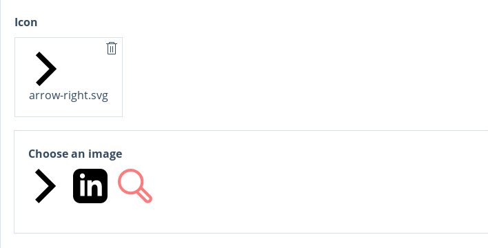
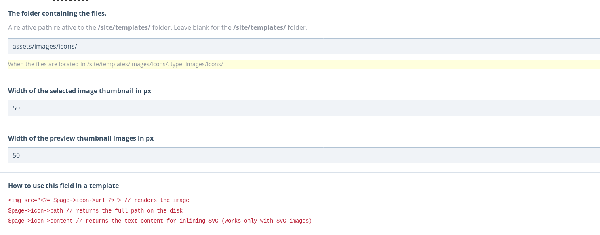

# FieldtypeImagePicker & InputfieldImagePicker

**Inputfield Image Picker** is an Inputfield & Fieldtype to select a single image file from a predefined folder on the server.



### Settings

* The folder containing the files.
    - A relative path relative to the /site/templates/ folder.
* Width of chosen image in Inputfield
* Width of image thumbnails in Inputfield 



Settings are per field.

### When to use ?

Let editors choose an image from a predefined folder. 
Other than the native ProcessWire image field, the images here are not stored per page and can not be manipulated by API resizing/cropping. 
Suited for images that are used throughout the site and don't need dynamic resizing/cropping. 
This Fieldtype was developed to give editors the abilty to choose icons from a custom SVG icon set. But it can be used for any type of images. 

### How to render in template files
```php
// render image 
fieldname->url ?>"> 
// render full disk path 
$page->fieldname->path
// render the text content for inlining SVG (works only with SVG images)
$page->fieldname->content
```

### Credits
This module was developed based on [Martijn Geerts' FieldTypeSelectFile module](https://github.com/Da-Fecto/FieldtypeSelectFile)
