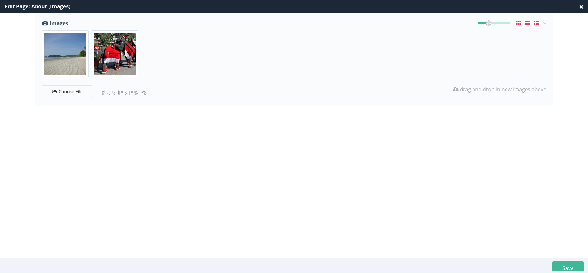
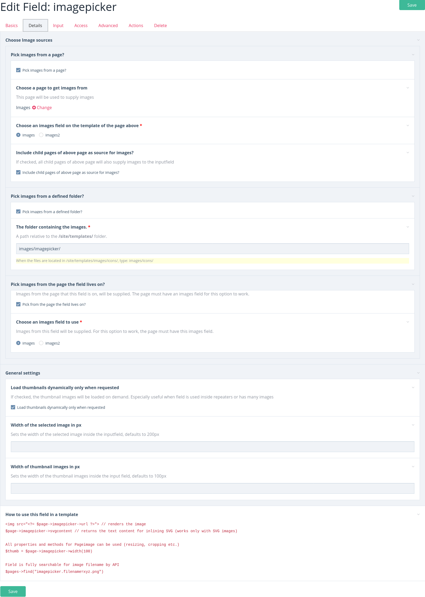

# FieldtypeImageReference & InputfieldImageReference
**This module was renamed from the former ImagePicker Fieldtype and Inputfield. Due to the renaming, version v2.0.0 introduces breaking changes. If you have an older version already installed, you need to uninstall it first and then install v2.0.0**

**Fieldtype Image Reference** is a Fieldtype that stores a reference to a single image from 
* from a folder inside site/templates/
* from any page on the site. 

The image can be selected with the associated Inputfield.

**Inputfield Image Reference** is an Inputfield to select a single image from 
* images on another page and optionally its children
* and/or from a folder inside site/templates/
* and/or from the page that is being edited 
* and/or from any page on the site.


You can upload/edit images to other pages from within the input field


### When to use ?
If you want to let editors choose an image from a set of images that is being used site-wide. Ideal for images that are being re-used across the site (e.g. icons, but not limited to that).
Other than the native ProcessWire images field, the images here are not stored per page. Only references to images that live on other pages or inside a folder are stored. This has several advantages:
* one central place to organize images
* when images change, you only have to update them in one place. All references will be updated, too. (Provided the name of the image that has changed stays the same)

### Features
* Images can be loaded from a folder inside site/templates/
* Images can be loaded from other pages defined as image source
* Images can be organized into categories. Child pages of the main 'image source page' serve as categories
* Images can be loaded from any page on the site
* From the API side, images can be manipulated like native ProcessWire images (resizing, cropping etc.), even the images from a folder
* Image thumbnails are loaded into inputfield by ajax on demand
* Markup of SVG images can be rendered inline with `echo $image->svgcontent`
* Image names are fully searchable through the API
```php
$pages->find('fieldname.filename=xyz.png');
$pages->find('fieldname.filename%=xy.png');
```
* Accidental image deletion is prevented. When you want to delete an image from one of the pages that hold your site-wide images, the module searches all pages that use that image. If any page contains a reference to the image you are trying to delete, deletion will be prevented. You will get an error message with links to help you edit those pages and remove references there before you can finally delete the image.
* This field type can be used with [marcrura's Settings Factory module](https://modules.processwire.com/modules/settings-factory/) to store images on settings pages, which was not possible with other image field types

### Settings / Options
* The page containing the images to choose from.
    - images from that page and optionally it's child pages will be used as site-wide images.
* Option to include images from child pages of the page that contains images
* A folder containing the images to choose from
* Option to also include the images from the page being edited
* Option to choose images from any page on the site
* The image fields to use. These fields will supply images to the image reference field
* Width of chosen image in Inputfield.
* Width of image thumbnails in Inputfield.



All settings are per field that you create from this fieldtype. This means you can have different images to choose from for different fields that you create.

### How to install and setup
1. [Download](https://github.com/gebeer/FieldtypeImageReference/archive/master.zip) and install or [install from URL](https://github.com/gebeer/FieldtypeImageReference/archive/master.zip) the module like any other modules in ProcessWire
2. Optional: create a page in the page tree that will hold your images and supply them to the inputfield. This page's template must have an images field
3. Optional: upload some images to the page you created in step 2
4. Optional: upload images to a folder inside site/templates
5. Create a new field. As type choose 'Image Reference'. Save the field.
6. Optional: in 'Details' Tab of the field choose the page you created in step 2
7. Optional: click Save button
9. Optional: click Save button again
10. Optional: upload images to a folder inside site/templates
11. Optional: choose to use that folder as image source
12. Optional: choose whether you want to include child pages of page from step 2 to supply images
13. Optional: choose whether you want to include images from the page being edited
14. Optional: choose images from any page of the site
15. Optional: choose the images field names of the fields that supply images
16. Add the field to any template
17. You are now ready to use the field

### How to use in template files
```php
// render image 
fieldname->url ?>"> 
// all native ProcessWIre image manipulation methods (resizing, cropping etc.) are available
$thumb = $page->fieldname->width(100);
// render the text content for inlining SVG (works only with SVG images)
$page->fieldname->svgcontent
// search pages with image by file name or page id of the source page
$pages->find('fieldname.filename=xyz.png');
$pages->find('fieldname.pageid=1234');
```

### Requirements
* Processwire >= 3.0.120
* PHP >= 7.1

### [ProcessWire forum thread](https://processwire.com/talk/topic/22665-module-imagereference-pick-images-from-various-sources/)

### Credits
This module was developed based on ideas from forum members in [this forum thread](https://processwire.com/talk/topic/22732-fieldtypeimagefrompage-pick-an-image-from-various-sources/)

### Roadmap
* upload widget for images in folder
* allow to choose multiple images